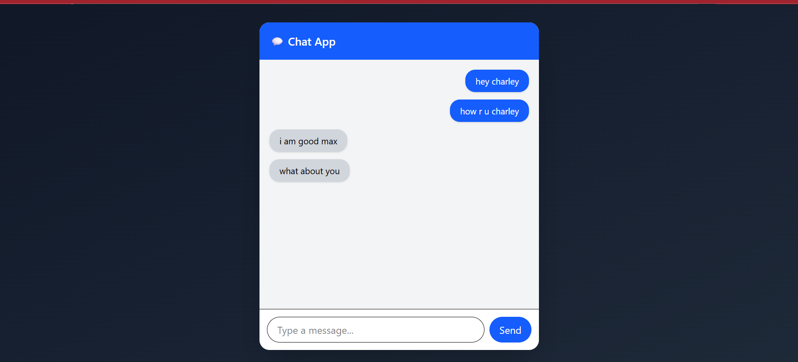
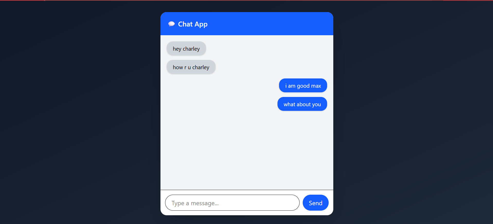

# 💬 Real-Time Chat App

A modern real-time chat application built using **React.js, Node.js, Express, and Socket.io** 🚀  
This app allows multiple users to send and receive messages instantly with a clean and responsive UI.

---

## 🔥 Features

✨ Real-time messaging using Socket.io  
👥 Multi-user chat support  
🎨 Modern UI with Tailwind CSS  
📱 Responsive design  

---

## 🧠 Tech Stack

- ⚛️ React.js
- 🌐 Node.js + Express
- 🔌 Socket.io
- 🎨 Tailwind CSS

---

## 📸 Screenshots

### 💻 Chat Interface


### 💬 Real-time Messaging (2 Tabs)

---

## ⚙️ Installation & Setup

### 1️⃣ Clone the repository
```bash
git clone https://github.com/your-username/chat-app.git
cd chat-app
